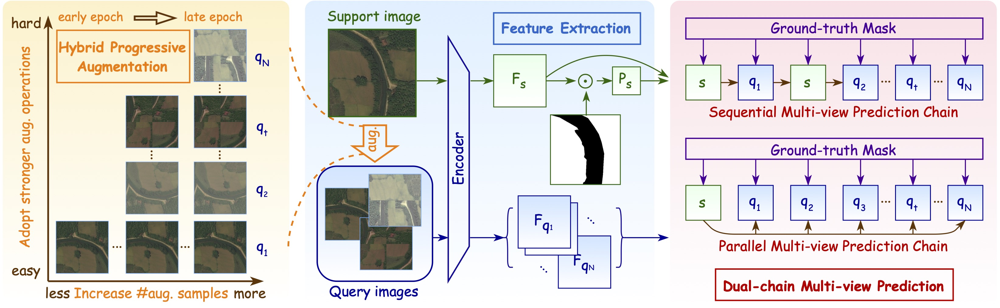
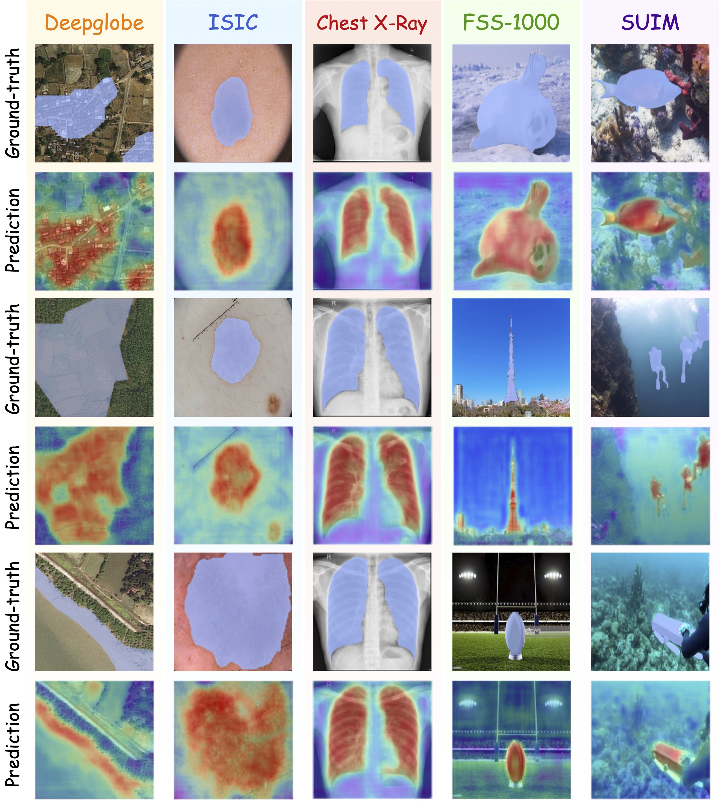

# [CVPR 2026] Cross-Domain Few-Shot Segmentation via Multi-view Progressive Adaptation

The official implementation of "Cross-Domain Few-Shot Segmentation via Multi-view Progressive Adaptation".
More detailed information is in the [PAPER](https://arxiv.org/pdf/2602.05217).

Authors: [Jiahao Nie<sup>*</sup>](https://scholar.google.com/citations?user=LGM10RQAAAAJ&hl=zh-CN&inst=8669986779262753491&oi=ao) Guanqiao Fu<sup>*</sup>, [Wenbin An](https://scholar.google.com/citations?user=BpkQZGgAAAAJ&hl=zh-CN&oi=ao), [Yap-Peng Tan](https://scholar.google.com/citations?user=9sQVUMoAAAAJ&hl=zh-CN)</a>, [Alex C. Kot](https://scholar.google.com/citations?user=UGZXLxIAAAAJ&hl=zh-CN&inst=8669986779262753491&oi=ao), [Shijian Lu](https://scholar.google.com/citations?user=uYmK-A0AAAAJ&hl=zh-CN&inst=8669986779262753491&oi=ao)

 <p align="middle">
    
</p> 


## Datasets
The following datasets are used for evaluation in CD-FSS:

### Target domains: 
* **Deepglobe**:
  
    Home: http://deepglobe.org/

    Direct: https://www.kaggle.com/datasets/balraj98/deepglobe-land-cover-classification-dataset   

    Data Preprocessing Code: Please refer [preprocess_deepglobe.py](https://github.com/niejiahao1998/IFA/tree/master/data/preprocess_deepglobe.py) or [PATNet repo](https://github.com/slei109/PATNet).

* **ISIC2018**:
  
    Home: http://challenge2018.isic-archive.com

    Direct (must login): https://challenge.isic-archive.com/data#2018

    Class Information: data/isic/class_id.csv

    Data Preprocessing Code: Please refer [preprocess_isic.py](https://github.com/niejiahao1998/IFA/tree/master/data/preprocess_isic.py) or [PATNet repo](https://github.com/slei109/PATNet).

* **Chest X-ray**:
  
    Home: https://www.ncbi.nlm.nih.gov/pmc/articles/PMC4256233/

    Direct: https://www.kaggle.com/datasets/nikhilpandey360/chest-xray-masks-and-labels

* **FSS-1000**:
  
    Home: https://github.com/HKUSTCV/FSS-1000

    Direct: https://drive.google.com/file/d/16TgqOeI_0P41Eh3jWQlxlRXG9KIqtMgI/view

* **SUIM**:

    Home: https://www.kaggle.com/datasets/ashish2001/semantic-segmentation-of-underwater-imagery-suim

## Pre-trained ResNet Models
Download pre-trained ResNet models: [GoogleDrive](https://drive.google.com/drive/folders/1oeDfNks2ToOlsDlMArozLx2z2l1QDP51?usp=sharing)

## Performance and Trained Models
The performances of model without source-training stage are listed below:

| Datasets    | Setting  | mIOU     | Setting  | mIOU     |
| --------    | -------- | -------- | -------- | -------- |
| Deepglobe   | 1-Shot   | 53.1%    | 5-Shot   | 59.4%    |
| ISIC        | 1-Shot   | 71,1%    | 5-Shot   | 71.3%    |
| Chest X-Ray | 1-Shot   | 89.0%    | 5-Shot   | 90.6%    |
| FSS-1000    | 1-Shot   | 80.2%    | 5-Shot   | 80.8%    |
| SUIM        | 1-Shot   | 54.2%    | 5-Shot   | 61.1%    |

<p align="middle">
    
</p>

### File Organization
```
    IFA/                                                # project file
    ├── dataset/                                        # dataset
    |   ├── Deepglobe                                   # target dataset: deepglobe
    |   |   ├── 01_train_ori/                           # original data
    |   |   ├── ...
    |   |   └── 04_train_cat/                           # processed data
    |   |       ├── 1/                                  # category
    |   |       |   └── test/
    |   |       |       ├── origin/                     # image
    |   |       |       └── groundtruth/                # mask
    |   |       └── ...    
    |   ├── ISIC/                                       # target dataset: isic
    |   |   ├── ISIC2018_Task1-2_Training_Input/        # image
    |   |   |   ├── 1/                                  # category
    |   |   |   └── ...
    |   |   └── ISIC2018_Task1_Training_GroundTruth/    # mask
    |   |       └── ...
    |   ├── LungSegmentation/                           # target dataset: chest x-ray
    |   |   ├── CXR_png/                                # image
    |   |   └── masks/                                  # mask
    |   └── FSS-1000                                    # target dataset: fss-1000
    |       ├── ab_wheel/                               # category
    |       └── ...
    |    
    ├── pretrained/                                     # pretrained resnet models
    |   ├── resnet50.pth
    |   └── resnet101.pth
    |
    └── trained_models/                                 # official trained models
        ├── deepglobe/                                  # target dataset
        └── ...
```

## Run the code

Here is an example on Deepglobe dataset:

You can use MPA to fine-tuning the model on the target dataset:
```
CUDA_VISIBLE_DEVICES=0 python -W ignore mpa.py \
  --dataset deepglobe --data-root ./dataset \
  --backbone resnet50 --batch-size 12 --shot 1 --refine --lr 0.0005
```

Please note that the performances may flutuate within a small range because of differnet batch-sizes, seeds, devices, and environments.

## Citation
If you use this codebase for your research, please consider citing:
```
@article{nie2026cross,
  title={Cross-Domain Few-Shot Segmentation via Multi-view Progressive Adaptation},
  author={Nie, Jiahao and Fu, Guanqiao and An, Wenbin and Tan, Yap-Peng and Kot, Alex C and Lu, Shijian},
  journal={arXiv preprint arXiv:2602.05217},
  year={2026}
}
 ```

 ```
@article{nie2024cross,
  title={Cross-Domain Few-Shot Segmentation via Iterative Support-Query Correspondence Mining},
  author={Nie, Jiahao and Xing, Yun and Zhang, Gongjie and Yan, Pei and Xiao, Aoran and Tan, Yap-Peng and Kot, Alex C and Lu, Shijian},
  journal={arXiv preprint arXiv:2401.08407},
  year={2024}
}
 ```

 ```
@article{nie2026boosting,
  title={Boosting SAM for Cross-Domain Few-Shot Segmentation via Conditional Point Sparsification},
  author={Nie, Jiahao and Xing, Yun and An, Wenbin and Zhao, Qingsong and Shao, Jiawei and Tan, Yap-Peng and Kot, Alex C and Lu, Shijian and Li, Xuelong},
  journal={arXiv preprint arXiv:2602.05218},
  year={2026}
}
 ```

## Acknowledgement
Our codebase is built based on [IFA](https://github.com/niejiahao1998/IFA), [PATNet](https://github.com/slei109/PATNet), and [SSP](https://github.com/fanq15/SSP)'s official code.

We also thank [HSNet](https://github.com/juhongm999/hsnet) and other FSS and CD-FSS works for their great contributions.
